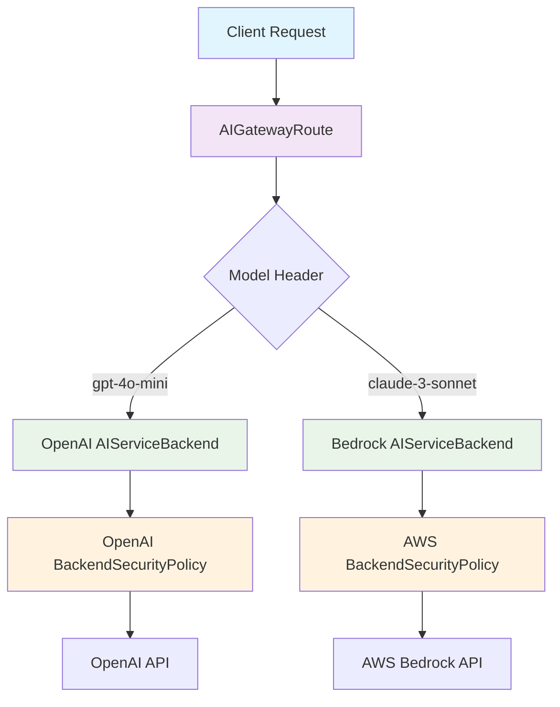

# Connecting to AI Providers

Envoy AI Gateway provides a unified interface for connecting to multiple AI providers through a standardized configuration approach. This page explains the fundamental concepts, resources, and relationships required to establish connectivity with any supported AI provider.

## Overview

Establishing connectivity with an AI provider involves configuring three key Kubernetes resources that work together to enable secure, scalable access to AI services:

1. **AIServiceBackend** - Defines the backend service and its API schema
2. **BackendSecurityPolicy** - Configures authentication credentials
3. **AIGatewayRoute** - Routes client requests to the appropriate backends

These resources provide a consistent configuration model regardless of which AI provider you're connecting to, whether it's OpenAI, AWS Bedrock, Azure OpenAI, or any other [supported provider](./supported-providers.md).

## Core Resources for Provider Connectivity

### AIServiceBackend

The `AIServiceBackend` resource represents an individual AI service backend and serves as the bridge between your gateway and the AI provider's API.

#### Purpose and Configuration

- **API Schema Definition**: Specifies which API format the backend expects (OpenAI v1, AWS Bedrock, Azure OpenAI, etc.)
- **Backend Reference**: Points to the Kubernetes Service or backend endpoint
- **Security Integration**: Links to authentication policies for upstream services

#### Key Fields

```yaml
apiVersion: aigateway.envoyproxy.io/v1alpha1
kind: AIServiceBackend
metadata:
  name: my-provider-backend
spec:
  # API schema the backend expects
  schema:
    name: "OpenAI"           # Provider API format
    version: "v1"            # API version
  
  # Reference to the actual backend service
  backendRef:
    name: my-provider-service
    kind: Service
    
  # Security policy for authentication
  backendSecurityPolicyRef:
    name: my-provider-auth
```

#### Schema Configuration Examples

Different providers require different schema configurations:

| Provider | Schema Configuration |
|----------|---------------------|
| OpenAI | `{"name":"OpenAI","version":"v1"}` |
| AWS Bedrock | `{"name":"AWSBedrock"}` |
| Azure OpenAI | `{"name":"AzureOpenAI","version":"2025-01-01-preview"}` |
| Groq | `{"name":"OpenAI","version":"openai/v1"}` |
| Mistral | `{"name":"OpenAI","version":"v1"}` |

:::tip
Many providers offer OpenAI-compatible APIs, which allows them to use the OpenAI schema configuration with provider-specific version paths.
:::

### BackendSecurityPolicy

The `BackendSecurityPolicy` resource configures authentication credentials needed to access upstream AI services securely.

#### Purpose and Configuration

- **Credential Management**: Stores API keys, cloud credentials, or other authentication mechanisms
- **Security Isolation**: Keeps sensitive credentials separate from routing configuration
- **Provider Flexibility**: Supports multiple authentication types for different providers

#### Authentication Types

**API Key Authentication** (Most Common)
```yaml
apiVersion: aigateway.envoyproxy.io/v1alpha1
kind: BackendSecurityPolicy
metadata:
  name: openai-auth
spec:
  type: APIKey
  apiKey:
    secretRef:
      name: openai-secret
      key: api-key
```

**AWS Credentials** (For AWS Bedrock)
```yaml
apiVersion: aigateway.envoyproxy.io/v1alpha1
kind: BackendSecurityPolicy
metadata:
  name: bedrock-auth
spec:
  type: AWSCredentials
  awsCredentials:
    accessKeyIDRef:
      name: aws-secret
      key: access-key-id
    secretAccessKeyRef:
      name: aws-secret
      key: secret-access-key
    region: us-east-1
```

**Azure Credentials** (For Azure OpenAI)
```yaml
apiVersion: aigateway.envoyproxy.io/v1alpha1
kind: BackendSecurityPolicy
metadata:
  name: azure-auth
spec:
  type: AzureCredentials
  azureCredentials:
    apiKeyRef:
      name: azure-secret
      key: api-key
    endpoint: "https://my-resource.openai.azure.com"
```

#### Security Best Practices

- **Store credentials in Kubernetes Secrets**: Never expose sensitive data in plain text
- **Use principle of least privilege**: Grant only necessary permissions
- **Rotate credentials regularly**: Implement credential rotation policies
- **Separate environments**: Use different credentials for development, staging, and production

### AIGatewayRoute

The `AIGatewayRoute` resource defines how client requests are routed to appropriate AI backends and manages the unified API interface.

#### Purpose and Configuration

- **Request Routing**: Directs traffic to specific backends based on model names or other criteria
- **API Unification**: Provides a consistent interface regardless of backend provider
- **Request Transformation**: Automatically converts between different API schemas
- **Load Balancing**: Distributes traffic across multiple backends

#### Basic Configuration

```yaml
apiVersion: aigateway.envoyproxy.io/v1alpha1
kind: AIGatewayRoute
metadata:
  name: multi-provider-route
spec:
  # Client-facing API schema
  schema:
    name: OpenAI
    version: v1
    
  # Gateway to attach to
  targetRefs:
    - name: my-gateway
      kind: Gateway
      group: gateway.networking.k8s.io
      
  # Routing rules
  rules:
    - matches:
        - headers:
            - type: Exact
              name: x-ai-eg-model
              value: gpt-4o-mini
      backendRefs:
        - name: openai-backend
    - matches:
        - headers:
            - type: Exact
              name: x-ai-eg-model
              value: claude-3-sonnet
      backendRefs:
        - name: bedrock-backend
```

## Resource Relationships and Data Flow

Understanding how these resources work together is crucial for successful provider connectivity:



### Data Flow Process

1. **Request Reception**: Client sends a request to the AI Gateway with the OpenAI-compatible format
2. **Route Matching**: AIGatewayRoute examines request headers (like `x-ai-eg-model`) to determine the target backend
3. **Backend Resolution**: The matching rule identifies the appropriate AIServiceBackend
4. **Authentication**: The AIServiceBackend's security policy provides credentials for upstream authentication
5. **Schema Transformation**: If needed, the request is transformed from the input schema to the backend's expected schema
6. **Provider Communication**: The request is forwarded to the actual AI provider with proper authentication
7. **Response Processing**: The provider's response is transformed back to the unified schema format
8. **Client Response**: The standardized response is returned to the client

## Common Configuration Patterns

### Single Provider Setup

For a simple single-provider setup:

```yaml
# Backend configuration
apiVersion: aigateway.envoyproxy.io/v1alpha1
kind: AIServiceBackend
metadata:
  name: openai-backend
spec:
  schema:
    name: OpenAI
    version: v1
  backendRef:
    name: openai-service
    kind: Service
  backendSecurityPolicyRef:
    name: openai-auth

---
# Security configuration
apiVersion: aigateway.envoyproxy.io/v1alpha1
kind: BackendSecurityPolicy
metadata:
  name: openai-auth
spec:
  type: APIKey
  apiKey:
    secretRef:
      name: openai-secret
      key: api-key

---
# Routing configuration
apiVersion: aigateway.envoyproxy.io/v1alpha1
kind: AIGatewayRoute
metadata:
  name: openai-route
spec:
  schema:
    name: OpenAI
    version: v1
  targetRefs:
    - name: my-gateway
      kind: Gateway
  rules:
    - backendRefs:
        - name: openai-backend
```

### Multi-Provider Setup with Fallback

For high availability with multiple providers:

```yaml
apiVersion: aigateway.envoyproxy.io/v1alpha1
kind: AIGatewayRoute
metadata:
  name: multi-provider-fallback
spec:
  schema:
    name: OpenAI
    version: v1
  targetRefs:
    - name: my-gateway
      kind: Gateway
  rules:
    - matches:
        - headers:
            - type: Exact
              name: x-ai-eg-model
              value: gpt-4o-mini
      backendRefs:
        - name: openai-backend
        - name: groq-backend  # Fallback provider
```

### Model-Specific Routing

For routing different models to specialized providers:

```yaml
apiVersion: aigateway.envoyproxy.io/v1alpha1
kind: AIGatewayRoute
metadata:
  name: model-specific-routing
spec:
  schema:
    name: OpenAI
    version: v1
  targetRefs:
    - name: my-gateway
      kind: Gateway
  rules:
    - matches:
        - headers:
            - type: Exact
              name: x-ai-eg-model
              value: gpt-4o-mini
      backendRefs:
        - name: openai-backend
    - matches:
        - headers:
            - type: Exact
              name: x-ai-eg-model
              value: claude-3-sonnet
      backendRefs:
        - name: bedrock-backend
    - matches:
        - headers:
            - type: Exact
              name: x-ai-eg-model
              value: text-embedding-ada-002
      backendRefs:
        - name: openai-embeddings-backend
```

## Provider-Specific Considerations

### OpenAI-Compatible Providers

Many providers (Groq, Together AI, Mistral, etc.) offer OpenAI-compatible APIs:

- Use OpenAI schema configuration
- Adjust the version field if the provider uses custom paths
- Standard API key authentication typically applies

### Cloud Provider Integration

Cloud providers like AWS Bedrock and Azure OpenAI require:

- Cloud-specific credential types (AWS IAM, Azure Service Principal)
- Region specification for multi-region services
- Custom schema configurations for native APIs

### Self-Hosted Models

Self-hosted models using frameworks like vLLM:

- Often compatible with OpenAI schema
- May not require authentication (internal networks)
- Custom endpoints through Kubernetes Services

## Validation and Troubleshooting

### Configuration Validation

The AI Gateway validates configurations at deployment time:

- **Schema Compatibility**: Ensures input and output schemas are compatible
- **Resource References**: Validates that referenced resources exist
- **Credential Access**: Verifies that secrets are accessible

### Common Issues and Solutions

**Authentication Failures (401/403)**
- Verify API keys and credentials are correct
- Check secret references and key names
- Ensure credentials have necessary permissions

**Schema Mismatch Errors**
- Confirm the backend schema matches the provider's API
- Check version specifications for provider-specific paths
- Review API documentation for schema requirements

**Routing Issues**
- Verify header matching rules in AIGatewayRoute
- Check that model names match expected values
- Ensure backend references point to existing AIServiceBackends

## Next Steps

Now that you understand the connectivity fundamentals:

- **[Supported Providers](./supported-providers.md)** - View the complete list of supported providers and their configurations
- **[Supported Endpoints](./supported-endpoints.md)** - Learn about available API endpoints and their capabilities
- **[Getting Started Guide](../../getting-started/connect-providers/)** - Follow hands-on tutorials for specific providers
- **[Traffic Management](../traffic/)** - Configure advanced routing, rate limiting, and fallback strategies
- **[Security](../security/)** - Implement comprehensive security policies for your AI traffic

## API Reference

For detailed information about resource fields and configuration options:

- [AIServiceBackend API Reference](../../api/api.mdx#aiservicebackend)
- [BackendSecurityPolicy API Reference](../../api/api.mdx#backendsecuritypolicy)
- [AIGatewayRoute API Reference](../../api/api.mdx#aigatewayroute)